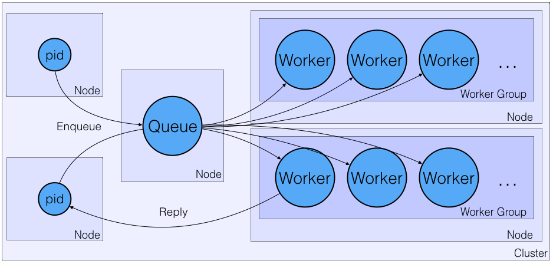

### Global Queue Example


Say we've got some pretty heavy tasks that we want to distribute over a farm of background job processing nodes, they're too heavy to process on our client-facing nodes. In a distributed Erlang scenario, you have the option of distributing Honeydew's various components around different nodes in your cluster. Honeydew is basically a simple collection of queue processes and worker processes. Honeydew detects when nodes go up and down, and reconnects workers.

To start a global queue, pass a `{:global, name}` tuple when you start Honeydew's components

In this example, we'll use the Mnesia queue with stateless workers.

We'll start the queue on node `queue@dax` with:

```elixir
defmodule QueueApp do
  def start do
    :ok = Honeydew.start_queue({:global, :my_queue}, queue: {Honeydew.Queue.Mnesia, [disc_copies: nodes]})
  end
end

iex(queue@dax)1> QueueApp.start
:ok
```

And we'll run our workers on `worker@dax` with:
```elixir
defmodule HeavyTask do
  @behaviour Honeydew.Worker

  # note that in this case, our worker is stateless, so we left out `init/1`

  def work_really_hard(secs) do
    :timer.sleep(1_000 * secs)
    IO.puts "I worked really hard for #{secs} secs!"
  end
end

defmodule WorkerApp do
  def start do
    :ok = Honeydew.start_workers({:global, :my_queue}, HeavyTask, num: 10, nodes: [:clientfacing@dax, :queue@dax])
  end
end

iex(background@dax)1> WorkerApp.start
:ok
```

Note that we've provided a list of nodes to the worker spec, Honeydew will attempt to heal the cluster if any of these nodes go down.

Then on any node in the cluster, we can enqueue a job:

```elixir
iex(clientfacing@dax)1> {:work_really_hard, [5]} |> Honeydew.async({:global, :my_queue})
%Honeydew.Job{by: nil, failure_private: nil, from: nil, monitor: nil,
 private: {false, -576460752303423485}, queue: {:global, :my_queue},
 result: nil, task: {:work_really_hard, [5]}}
```

The job will run on the worker node, five seconds later it'll print `I worked really hard for 5 secs!`
